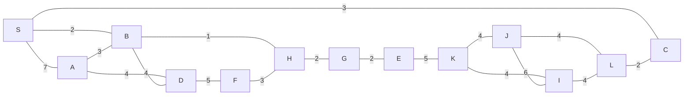

# Dijkstra's Algorithm

Given a graph of a road network, where the weights of each edge represent the difficulty of traversing the road (smaller is better and represents a faster road), Dijkstra's algorithm basically starts by inspecting the fastest roads first. It does this using a priority queue.

Dijkstra's algorithm only works on directed graphs, and the edges cannot have negative values.



```javascript
function Dijkstra(Graph, source):

  create vertex set Q

  for each vertex v in Graph:            
      dist[v] ← INFINITY                 
      prev[v] ← UNDEFINED                
      add v to Q                     
  dist[source] ← 0                       
 
  while Q is not empty:
      u ← vertex in Q with min dist[u]   
                                         
      remove u from Q
     
      // only v that are still in Q
      for each neighbor v of u:           
          alt ← dist[u] + length(u, v)
          if alt < dist[v]:              
              dist[v] ← alt
              prev[v] ← u

  return dist[], prev[]
```