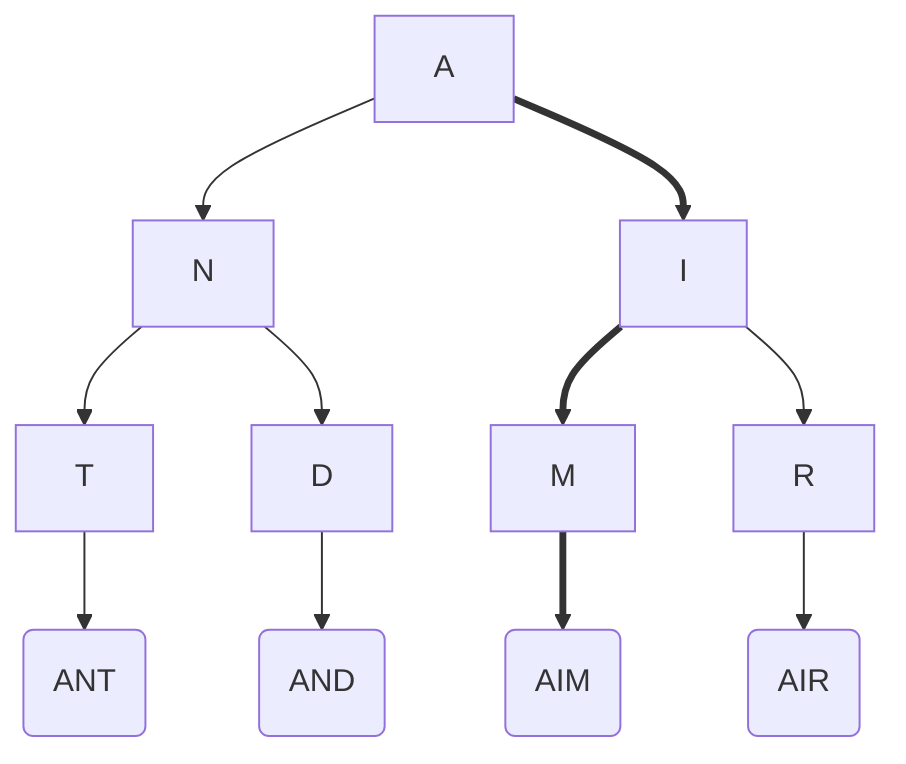

# Common Strategies
https://hackernoon.com/14-patterns-to-ace-any-coding-interview-question-c5bb3357f6ed

## Cheat Sheet
>1.  IF sorted THEN (binary search OR two pointer)
>2.  IF all permutations/subsets THEN backtracking
>3.  IF tree THEN (recursion OR two pointer OR obvious recursion below)
>4.  IF graph THEN dfs/bfs
>5.  IF linkedlist $O(1)$ space THEN two pointer
>6.  IF obvious recursion problem but recursion banned THEN stack
>7.  IF options (+1 or +2) OR min/max + previously made choices THEN DP
>8.  IF k items THEN heap
>9.  IF common strings THEN (map OR trie)
>10.  ELSE (map/set for $O(n)$ time $O(n)$ space or sort for $O(n \cdot log \cdot n)$ time $O(1)$ space)

## Multiple pointers
When iterating through arrays, strings, Linked Lists - having two pointers - a fast one and a slow one, or one high one low, is often part of the solution.

## Iterate in reverse
Many solutions involve either traversing an array from the right-hand side or adding elements to an array from the end. This is especially common with `String` related questions.

## Sorting
Could the problem be made any simpler by pre-sorting the inputs? This tends to enable [[Binary Search]] - which can be used on more than just numbers!

## Backtracking
This strategy is used when the solution is a series of choices, and each choice constraints subsequent choices. These types of problems are known as Constraint Satisfaction Problems (CSPs), and are generally solved with recursion.

Backtracking problems can be thought of as trees where decisions are made at each node. When we evaluate a new node and decide it's not for us, we backtrack to the parent and investigate the next node. In doing so, we are _pruning_ the recursion tree - rather than enumerating all possible choices, we're eagerly rejecting invalid decisions.



### General Algorithm
```javascript
function backtrack(candidate)
    if find_solution(candidate) {
        output(candidate)
        return
	}
    
    // iterate all possible candidates.
    for next_candidate in list_of_candidates
        if is_valid(next_candidate)
            // try this partial candidate solution
            place(next_candidate)
            // given the candidate, explore further.
            backtrack(next_candidate)
            // backtrack
            remove(next_candidate)
```

### Example
Find all valid combinations of `k` numbers that sum up to `n` such that the following conditions are true:

-   Only numbers `1` through `9` are used.
-   Each number is used **at most once**.

Return _a list of all possible valid combinations_. The list must not contain the same combination twice, and the combinations may be returned in any order.

```kotlin
fun combinationSum3(k: Int, target: Int): List<List<Int>> {
	val results = mutableListOf<List<Int>>()
	backtrack(target, k, 0, results, LinkedList())
	return results
}

private fun backtrack(
	remain: Int,
	k: Int,
	nextStart: Int,
	results: MutableList<List<Int>>,
	combinations: LinkedList<Int>
) {
	// Basecase where nothing remaing having chosen k integers
	if (remain == 0 && combinations.size == k) {
		results.add(combinations.toList())
		return
	// Basecase where we missed the target with k integers
	} else if (remain < 0 || combinations.size == k) {
		return
	}

	for (index in nextStart until 9) {
		combinations.add(index + 1)
		backtrack(remain - index - 1, k, index + 1, results, combinations)
		combinations.removeLast()
	}
}
```

## Greedy Algorithms
This is the opposite of backtracking - optimize for a certain thing (for instance, value of items in a knapsack) and never backtrack. You cannot guarantee that this method will produce the optimum solution, but it will likely be _good enough_ for some types of problems, and much faster.

We don't investigate whether or not the previous choice makes a difference to future choices.

## Divide and conquer
Divide problems into smaller pieces with optimal substructure and compute from there.

For instance: merge sort, $O(n \cdot log \cdot n)$

```javascript
function merge_sort(list)
    if list.length == 1
        return list
    
    left <- list.first_half
    right <- list.second_half
    
    return merge(
        merge_sort(left),
        merge_sort(right)
    )
```

## Dynamic Programming
Identifying identical/overlapping sub-problems so that we don't have to compute them more than once - see [[Dynamic Programming]]. Consider Fibonacci:

```javascript
function fib(n)
    if n <= 2 
        return 1
    
    return fib(n - 1) + fib(n - 2)
```

In the recursive solution, `fib(3)` would be calculated multiple times. We can store these values so that we don't have to calculate them repeatedly:

```javascript
M <- [1 => 1; 2 => 2]
function d_fib(n)
    if n not in M
        M[n] <- d_fib(n - 1) + d_fib(n - 2)
    return M[n]
```

Often these solutions involve matrices and summing the surrounding values - could these be stored in temporary variables only, reducing the space complexity from $O(n \cdot m)$ to $O(1)$?

Remember that for dynamic programming, the base case is often `0`, so many arrays will be built as such:

```kotlin
fun knapsackProblem(items: List<List<Int>>, capacity: Int): Pair<Int, List<Int>> {
    val array = List(items.size + 1) { MutableList(capacity.size + 1) { 0 } }
	
	// ...
}
```

See also [[Knapsack Problem]].

There's two main approaches in dynamic programming:

### Memoization
Memoization is where we add caching to a function - typically this is used on recursive functions for a **top-down** solution that starts with the initial problem and then recursively calls itself to solve smaller problems.

### Tabulation
Tabulation uses a table to keep track of sub-problem results and works in a **bottom-up** manner: solving the smallest sub-problems in an iterative manner before solving the larger ones.

## Branch and Bound
Many problems involve trying to find maximum profits, shortest paths etc - these are called _optimization problems_. When the solution is a series of choices, we can use a strategy called Branch and Bound.

## Sliding Window
Given an array:
```javascript
[a b c d e f g h]
```

A sliding window of size 3 would look like:

```javascript
[a b c]
  [b c d]
    [c d e]
      [d e f]
        [e f g]
          [f g h]
```

Often we'll be summing these slices - we could end up doing a lot of unnecessary work:

```javascript
[4,6,3],8,3
4,[6,3,8],3
```
For the second slice, rather than sum every value, we can take the last slice value, subtract the `4` and add the `3`. See [this](https://stackoverflow.com/a/64111403/3245482) answer on StackOverflow for a visual representation.

### Example
Given the height of a staircase and the max number of steps you can take at any one time, calculate the number of ways you can climb a staircase.

```javascript
height = 4
maxSteps = 2
output = 5
// 1, 1, 1, 1
// 1, 1, 2
// 1, 2, 1
// 2, 1, 1
// 2, 2
```

```kotlin
fun staircaseTraversal(height: Int, maxSteps: Int): Int {
	var currentNumberOfWays = 0
	val waysToTop = mutableListOf(1)
	
	// height + 1 because we must account for 0th step, which can be traversed
	// in exactly 1 step
	for (currentHeight in 1 until height + 1) {
		// Window size is maxSteps
		val startOfWindow = currentHeight - maxSteps - 1
		val endOfWindow = currentHeight - 1
		// Remove the value from the start of the window
		if (startOfWindow >= 0) currentNumberOfWays -= waysToTop[startOfWindow]
		// Add the value at the end of the window
		currentNumberOfWays += waysToTop[endOfWindow]
		
		waysToTop.add(currentNumberOfWays)
	}
	
	return waysToTop[height]
}
```


