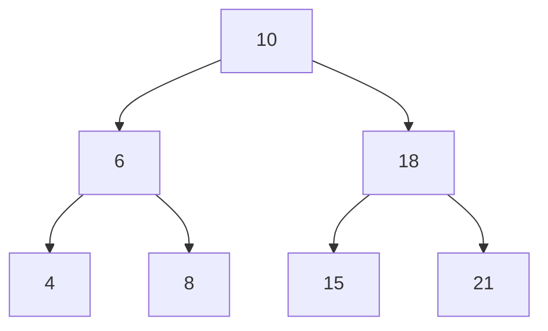

# Binary Search Trees

A binary search tree is a Tree data structure where:

- Nodes can only have two or less children
- Children nodes to the left of the parent must be smaller in value
- Children nodes to the right of the parent must be larger in value



# Time Complexity
| Operation | Average | Worst |
|-|-|-|
| Space | $O(n)$ | $O(n)$ |
| Search | $O(log \cdot n)$ | $O(n)$ |
| Insert | $O(log \cdot n)$ | $O(n)$ |
| Delete | $O(log \cdot n)$ | $O(n)$ |

### Basic search
Due to these rules, it's very easy to find a particular key/value within a tree:

```javascript
function find_node(binary_tree, value)
    node <- binary_tree.root_node
    
    while node:
        if node.value == value
            return node
        if value > node.value
            node <- node.right
        else
            node <- node.left
    
    return null          
```

### Insertion
To insert an item, we search the binary tree for the value we want to insert. We take the last node that we explored in the search, and make its right or left pointer point to the new node:

```javascript
function insert_node(binary_tree, new_node)
    node <- binary_tree.root_node
    
    while node:
        last_node <- node
        if new_node.value > node.value
            node <- node.right
        else 
            node <- node.left
    
    if new_node.value > last_node.value
        last_node.right <- new_node
    else 
        last_node.left <- new_node
```

### Deletion
There's lots of edgecases here:

- Search the tree as you normally would by searching left or right - but keep track of the parent
- Once the value is found:
    - If the node has two children:
        - Set the value of the node to the value of it's right child
        - Call remove on the right child
    - If the parent node is null
        - It's the root!
        - If the left child isn't null
            - Set the value of the current node to that of the left child
            - Set the right node to the left child's right node
            - Set the left node to the lefts childs's left node
        - If the right child isn't null
            - Set the value of the current node to that of the right child
            - Set the left node to the right child's left node
            - Set the right node to the right child's right node
        - If both children are null
            - Null out the value - you're done
    - If the current node is equal to the parent's left node
        - Set the parent node's left node to the current left ?: right node
    - If the current node is equal to the parent's right node
        - Set the parent node's right node to the current left ?: right node

### Balancing
Inserting too many nodes in a BST will result in a tree that's too tall, where many nodes have only one child - we can end up with something that looks more like a [[Linked List]]. This is inefficient -  the taller the tree, the longer the average path between nodes in the tree.

A perfectly balanced tree has the minimum possible height.

```javascript
function build_balanced(nodes)
    if nodes is empty
        return null
    
    middle <- nodes.length / 2
    left <- nodes.slice(0, middle - 1)
    right <- nodes.slice(middle + 1, nodes.length)
    
    balanced <- BinaryTree.new(root = nodes[middle])
    balanced.left <- build_balanced(left)
    balanced.right <- build_balanced(right)
    
    return balanced
```

* Maximum height - i.e. a [[Linked List]] is $n$
* Minimum height is $log \cdot n$
* Complexity of searching a tree is proportional to it's height
* In the worst-case, searching a tree requires searching all the way down to the deepest nodes, therefore searching is an $O(log \cdot n)$ operation.

Tree re-balancing is an expensive operation - re-balancing a tree after every insertion or deletion would rapidly get out of hand.

To handle the scenario where writes happen frequently, **self balancing trees** were invented - specifically the [[Red-Black Tree]] and [[AVL Tree]].

A B-Tree is often used for magnetic data storage - here we want more than two children per node so that we can efficiently work with data in large chunks.

### Constructing a balanced tree
If the input array is sorted, take the middle element and make it the root.

Slice the array into two - left and right sides. Take the midde element of each and make them the left and right children, respectively. 

Carry on doing this until you've run out of values.

```kotlin
class BST(var value: Int) {
    var left: BST? = null
    var right: BST? = null
}

fun minHeightBst(array: List<Int>): BST {
	return construct(array, 0, array.size - 1)!!
}

fun construct(array: List<Int>, start: Int, end: Int): BST? {
	if (end < start) return null
	
	val mid = (start + end) / 2
	val bst = BST(array[mid])
	bst.left = construct(array, start, mid - 1)
	bst.right = construct(array, mid + 1, end)
	
	return bst
}
```

### Compute If Balanced
A [[Binary Search Tree]] is balanced if the difference in height between the left and right subtree is no greater than 1. Note that the height of a `null` tree is generally `-1`.

```kotlin
fun isBalanced(root: Bst): Boolean {
	return checkHeight(root) != Int.MIN_VALUE
}

private fun checkHeight(root: Bst): Int {
	if (root == null) return -1
	
	val leftHeight = checkHeight(root.left)
	if (leftHeight == Int.MIN_VALUE) return Int.MIN_VALUE
	
	val rightHeight = checkHeight(root.right)
	if (rightHeight == Int.MIN_VALUE) return Int.MIN_VALUE
	
	val diff = leftHeight - rightHeight
	if (Math.abs(diff) > 1) {
		return Int.MIN_VALUE
	} else {
		return Math.max(leftHeight, rightHeight) + 1
	}
}
```