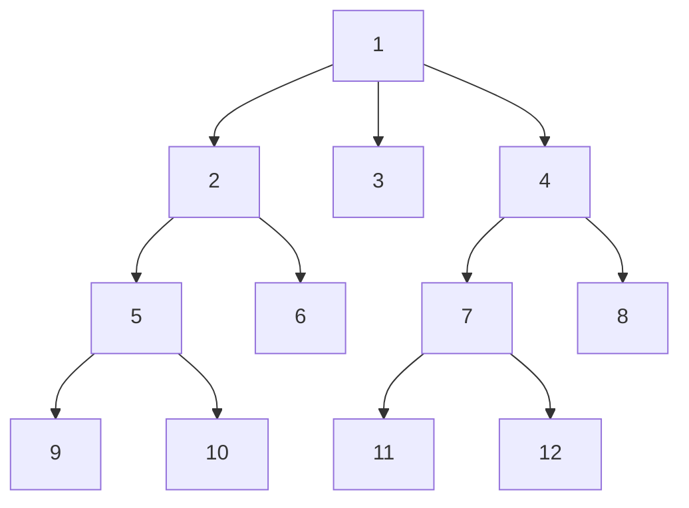
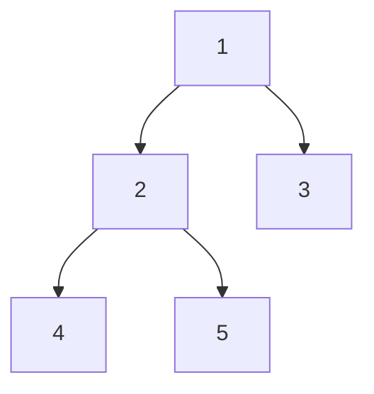

# Breadth-First Search

In Breadth-First Search, an algorithm starts at the root of the tree again but it explores neighbor nodes first, before moving to the next-level neighbors.

This is implemented by level order traversal.



Usecases:
* Copying garbage collection
* Finding the shortest path between two nodes, with the path measured by the number of edges
* Testing a graph for bipartiteness
* Maximum spanning tree for unweighted graph
* Web crawler
* Finding nodes in any connected component of a graph
* Computing maximum flow in a flow network
* Serialization/deserialization of a binary tree

# Implementations

Given a tree:



* Level order: 1 2 3 4 5

```javascript
function level_order(tree_node)
    queue <- Queue.new
    queue.add(tree_node)
    
    while (!queue.is_empty)
        temp_node <- queue.poll
        visit(temp_node.data)
        
        if temp_node.left != null
            queue.add(temp_node.left)
        if temp_node.right != null
            queue.add(temp_node.right)
```

### Implementation

```kotlin
fun breadthFirstSearch(root: BinaryTree): List<String> {
	val queue = LinkedList<BinaryTree>()
	queue.offer(root)  

	while (queue.isNotEmpty()) {  
		val node = queue.poll()  

		print(node.value)  

		if (node.left != null) queue.add(node.left)  
		if (node.right != null) queue.add(node.right)  
	}
}
```

### Usecase: Depth of a BST
```kotlin
fun maxDepth(root: TreeNode?): Int {
	if (root == null) return 0

	val queue = LinkedList<TreeNode>()
	queue.offer(root)

	var depth = 0

	while (queue.isNotEmpty()) {
		depth++
		val count = queue.size

		for (index in 0 until count) {
			val current = queue.poll()
			if (current.left != null) queue.offer(current.left!!)
			if (current.right != null) queue.offer(current.right!!)
		}
	}

	return depth
}
```