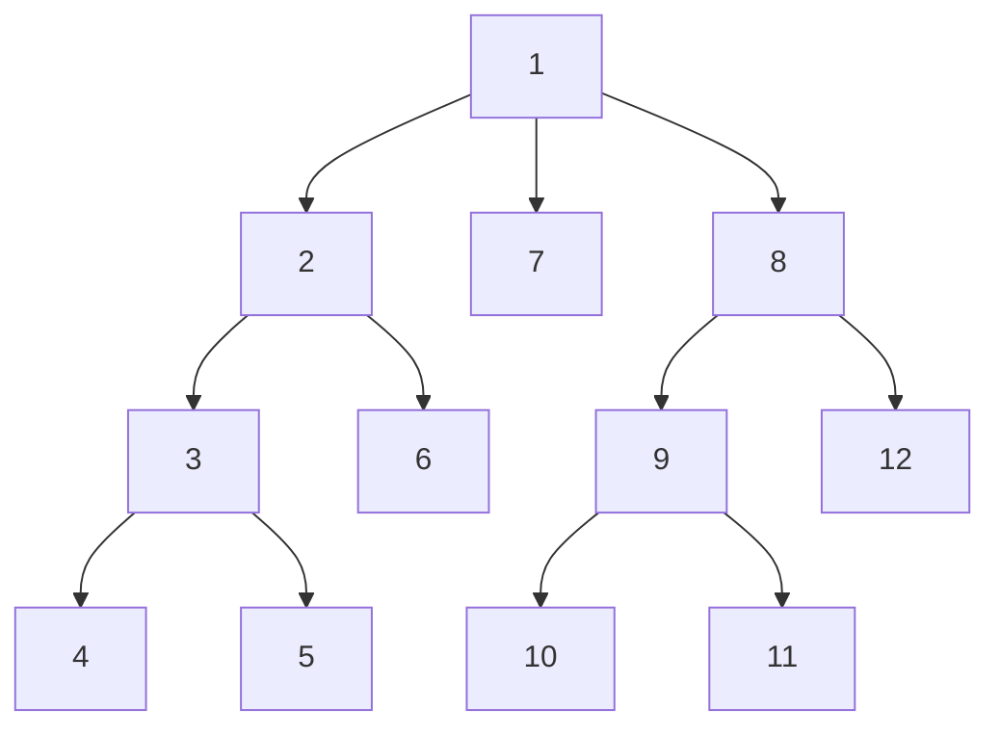
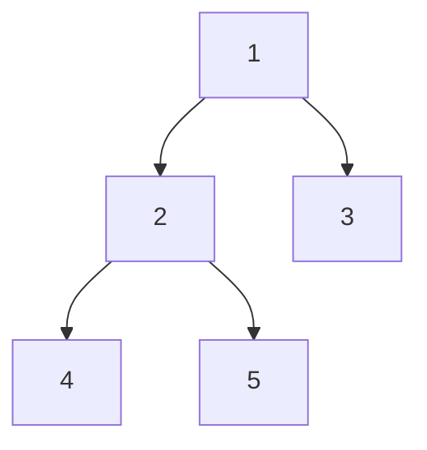

# Depth-First Search
In a Depth-First Search, an algorithm starts are the root of the tree and then explores as far along as possible before backtracking.

This can be implemented using pre-order, in-order and post-order traversal.



### Usecases
* Finding connected components in a graph
* Topological sorting in a DAG
* Finding 2/3 (edge or vertex) connected components
* Finding the bridges of a graph
* Finding strongly connected components
* Solving puzzles with only one solution such as mazes
* Finding biconnectivity in graphs

## In-Order
Given a tree:


  
* Left -> root -> right
*  4 2 5 1 3
*  As we visit the left (lowest) subtree first, we get values printed in ascending order (i.e. it's in-order!)

### Implementation

#### Recursive

```javscript
function in_order(tree_node)
    if tree_node == null
        return
    
    in_order(tree_node.left)
    visit(tree_node.data)
    in_order(tree_node.right)
```


#### Iterative

1) Create an empty stack.
2) Initialize current node as root
3) Push the current node to the stack and set current = current -> left until current is NULL
4) If current is NULL and stack is not empty then 
     a) Pop the top item from stack.
     b) Print the popped item, set current = popped_item -> right 
     c) Go to step 3.
5) If current is NULL and stack is empty then we are done.

```kotlin
fun inOrderTraverse(tree: BST) {
    val stack = LinkedList<BST>()
	var current: BST? = tree
	
	while (stack.isNotEmpty() || current != null) {
		while (current != null) {
			// Place a pointer to the tree node on the stack
			// before traversing left subtree
			stack.push(current)
			current = current.left
		}
		
		current = stack.pop()
		
		// Do something with the value
		val value = current.value
		
		// We've visited the node at it's left subtree
		// Time to visit the right instead!
		current = current.right
	}
}
```

Note that if you want to print the tree in **reverse** order, you simply swap `left` for `right`. This is useful in questions where you have to find the `k`th largest value.

## Preorder
Given a tree:


* Root -> left -> right
*  1 2 4 5 3
*  Used to make a copy of a tree 
*  Root is visited first
*  Implement with a Stack

### Implementation

#### Recursive

```javascript
function pre_order(tree_node)
    if tree_node == null
        return
    
    visit(tree_node.data)
    pre_order(tree_node.left)
    pre_order(tree_node.right)
```

#### Iterative
1) Create an empty stack and push root node to stack.   
2) Do the following while the stack is not empty.   
	a) Pop an item from the stack and print it.   
	b) Push right child of a popped item to stack   
	c) Push left child of a popped item to stack  

The right child is pushed before the left child to make sure that the left subtree is processed first.

```kotlin
fun preOrderTraverse(tree: BST) {
	val stack = LinkedList<BST>()
	stack.push(tree)
	
	while (stack.isNotEmpty()) {
		val node = stack.pop()
		
		// Do something with the value
		val value = node.value
		
		if (node.right != null) stack.push(node.right)
		if (node.left != null) stack.push(node.left)
	}
}
```

## Postorder
Given a tree:


* Left -> right -> root
*  4 5 2 3 1
*  Used for tree deletion
*  Root is visited last

### Implementation

#### Recursive

```javascript
function post_order(tree_node)
    if tree_node == null
        return
    
    post_order(tree_node.left)
    post_order(tree_node.right)
    visit(tree_node.data)
```

#### Iterative
1) Push root to first stack.
2) Loop while first stack is not empty
   a) Pop a node from first stack and push it to second stack
   b) Push left and right children of the popped node to first stack
3) Print contents of second stack

```kotlin
fun postOrderTraverse(tree: BST) {
	val stack1 = LinkedList<BST>()
	val stack2 = LinkedList<BST>()
	stack1.push(tree)
	
	while (stack1.isNotEmpty()) {
		// Pop from first stack, push to second stack
		val node = stack1.pop()
		stack2.push(node)
		
		if (node.left != null) stack1.push(node.left)
		if (node.right != null) stack1.push(node.right)
	}
	
	while (stack2.isNotEmpty()) {
		val node = stack2.pop()
		
		// Do something with the value
		val value = node.value
	}
}
```

# Tips
Don't forget that [[Depth-First Search]] can be used on matrices. When doing so, you may have to iterate through offsets - i.e. access the row above/blow and the column left/right:

```kotlin
private val RowOffsets = intArrayOf(0, 1, 0 , -1)
private val ColumnOffsets = intArrayOf(1, 0, -1 , 0)

for (offset in 0 until 4) {
	val ret = backtrack(
		board,
		target, 
		row + RowOffsets[offset], 
		column + ColumnOffsets[offset],
		index + 1
	)

	if (ret) break
}

```