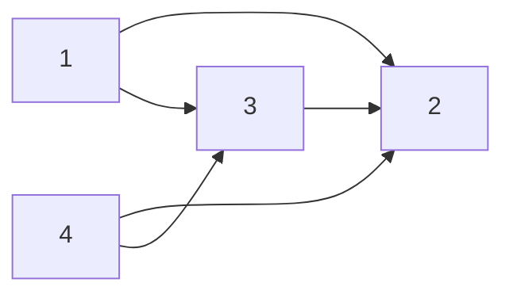

# Topological Sort

Works only on Directed Acyclic Graphs.

## Example
You're given a list of jobs that need to be completed. You're also given a list of dependencies, where each job in the list is a dependency of the next job.

Return a list of jobs in a valid order (there may be more than one).

```javascript
jobs = [1, 2, 3, 4]
deps = [[1, 2], [1, 3], [3, 2], [4, 2], [4, 3]]

output = [1, 4, 3, 2] or [4, 1, 3, 2]
```

This can be represented as a graph:



Notice how `1` and `4` have no dependencies - they can be safely added to the list first.

## Solution - $O(j + d)$, e.g. $O(v + e)$
1.  Iterate over all the edges in the input and create an adjacency list and also a map of node v/s in-degree.
2.  Initialize a queue, `Q` to keep a track of all the nodes in the graph with 0 in-degree.
3.  Add all the nodes with 0 in-degree to `Q`.
4.  The following steps are to be done until the `Q` becomes empty.
    1.  Pop a node from the `Q`. Let's call this node, `N`.
    2.  For all the neighbors of this node, `N`, reduce their in-degree by 1. If any of the nodes' in-degree reaches 0, add it to the `Q`.
    3.  Add the node `N` to the list maintaining topologically sorted order.
    4.  Continue from step 4.1.

```kotlin
fun findOrder(numCourses: Int, prerequisites: Array<IntArray>): IntArray {

    val adjacencyList = mutableMapOf<Int, MutableList<Int>>()
    val inDegree = IntArray(numCourses) { 0 }
    val topologicalOrder = IntArray(numCourses) { 0 }

    prerequisites.forEach { prerequisite ->
        val destination = prerequisite[0]
        val source = prerequisite[1]

        val list = adjacencyList.getOrDefault(source, mutableListOf())
        list.add(destination)
        adjacencyList[source] = list

        inDegree[destination] += 1
    }

    val queue = LinkedList<Int>()

    for (index in 0 until numCourses) {
        if (inDegree[index] == 0) {
            queue.add(index)
        }
    }

    var i = 0
    while (queue.isNotEmpty()) {
        val node = queue.remove()
        topologicalOrder[i++] = node

        if (adjacencyList.contains(node)) {
            adjacencyList[node]!!.forEach { neighbour ->
                inDegree[neighbour] -= 1

                if (inDegree[neighbour] == 0) {
                    queue.add(neighbour)
                }
            }
        }
    }

    return when (i) {
        numCourses -> topologicalOrder
        else -> intArrayOf()
    }
}
```