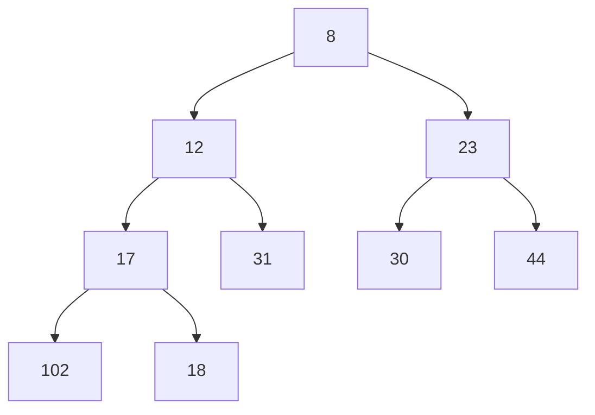

# Binary Heap
A binary heap is a special type of [[Binary Search Tree]] where we can find the smallest (min-heap) or highest (max-heap) value instantly - it's the root node.

It has the same rules for adding a node as a BST, with two additional rules:
- A parent node must be greater than (or smaller than) both child nodes - this is known as the Heap Property
- Each level of a tree must be filled up completely, except the last level which must be filled from left to right

Useful when you frequently work with the smallest or largest value in a set, but otherwise searching, insertion and deletion take the same amount of time.

# Array Representations

Given a Min Heap:



This can be represented with an array:

```javascript
[8, 12, 23, 17, 31, 30, 44, 102, 18]
```

To calculate the children of a current node at index $i$:

child one = $2i + 1$
child two = $2i + 2$

To calculate the parent index of any given node:

parent = floor$((i - 1) \div 2)$

# In Kotlin
Use the `ProrityQueue` interface:

```kotlin
val minHeap = PriorityQueue<ListNode> { a, b ->
	a.value - b.value
}

val maxHeap = PriorityQueue<ListNode> { a, b ->
	b.value - a.value
}

while (heap.isNotEmpty()) {  
    val node = heap.poll()  
    // Do something here 
}
```

# Usecase
Classically, these are used to merge `k` [[Linked List]]s in $O(N \cdot log \cdot k)$ time, where `k` is the number of Linked Lists.

```kotlin
fun mergeKLists(lists: Array<ListNode?>): ListNode? {
    val heap = PriorityQueue<ListNode> { a, b ->
        a.value - b.value
    }

    for (list in lists.filterNotNull()) {
        var current: ListNode? = list
        while (current != null) {
            heap.add(current)
            current = current.next
        }
    }

    val head = ListNode(0)
    var current = head

    while (heap.isNotEmpty()) {
        val node = heap.poll()
        node.next = null
        current.next = node
        current = current.next!!
    }

    return head.next
}
```

Heaps are also used to help find the median value from a stream in $O(log \cdot n)$ time:
- A max heap `lo` stores the lower half of the stream
- A min heap `hi` stores the higher half of the stream

```kotlin
class MedianFinder {

    // Max heap
    private val lo = PriorityQueue<Int> { a, b -> b - a}
    // Min heap
    private val hi = PriorityQueue<Int> { a, b -> a - b}
    
    fun addNum(num: Int) {
        lo.add(num)
        hi.add(lo.poll())
        
        if (lo.size < hi.size) {
            lo.add(hi.poll())
        }
    }

    fun findMedian(): Double = when {
        lo.size > hi.size -> lo.peek().toDouble()
        else -> (lo.peek() + hi.peek()) * 0.5
    }
}
```

# Complexity
- Insert/Delete $O(log \cdot n)$
- Poll $O(log \cdot n)$
- Peek $O(1)$

