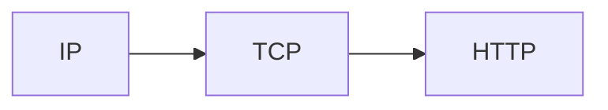

# Network Protocols

A protocol is an agreed-upon set of rules for communication. Clients and servers communicate via various existing protocols.

### IP (Internet Protocol)

- Yes, this is what the IP in IP Address stands for
- Data sent from one machine to another is sent via IP packets at it's most basic level
- These packets contain a header & data:

| Header |  Payload |
|-|-|
| Source IP destination IP size of packet IP version - IPv4 or IPv6 | Arbitrary data |

(Ignore the scaling of the diagram - in reality, the **payload** is much larger)

- These packets are $2^{16}$ bytes maximum - this isn't a lot of data! Therefore a great many packets have to be sent across the wire
- IP does not guarantee ordering
- IP has no way of confirming that the recipient received anything
- No error correction

### TCP (Transmission Control Protocol)

- To address the shortcomings of IP, TCP was created
- This has a way to see if data was received and guarantees the correct ordering
- Allows you to send arbitrarily long pieces of data

| Header | TCP Header |  Payload |
|-|-|-|
| Source IP destination IP size of packet IP version - IPv4 or IPv6 | Info about payload Ordering data | Arbitrary data |

- For a client and a server to communicate, a TCP connection is made and this connection is held open until a timeout or the client or server requests to end the connection
- This connection is opened via a handshake

### HTTP (HyperText Transfer Protocol)

- A higher level abstraction designed for developers which builds ontop of [[#TCP Transmission Control Protocol]]
- Uses a request <-> response paradigm

#### Requests
- **host** -> `adambennett.dev`
- **port** -> typically `80` or `443`
- **path** -> `/posts`
- **method** -> `GET`, `POST`, `PUT`, `DELETE`
- **headers** -> `content-type: application/json`, `content-length: 51`
- **body** -> arbitray data, typically JSON

#### Responses
- **status code** -> `200`, `404`, `500` etc
- **headers** -> `content-type: application/json`, `access-control-allow-origin: 'https://adambennett.dev'`
- **body** -> arbitray data, typically JSON

For more, see [[REST API Design]].

# Summary

