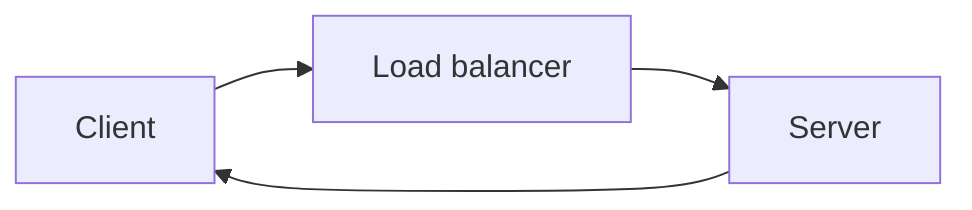

# Load Balancers

A [[Proxies#Reverse Proxies]] that distributes traffic across multiple servers using some kind of selection strategy.

Load balancers are used in every layer, from DNS to the database layer.

With DNS load balancers, a round-robin strategy might be used - `dig https://www.googlecom` will return _different_ IP addresses based on the load balancer. This is an extremely common pattern.

# Server Selection Strategy
- How a load balancer chooses which servers to distribute traffic to. 
- Multiple popular strategies:
	- Round robin
	- Weighted round robin
	- Random selection
	- Performance-based selection
	- IP-based strategy
	- Path-based - all requests related to a specific type of request (for instance, payments) can be distributed to specific servers

Round-robin strategies and others have a shortcoming - sequential, indentical requests from a client aren't guaranteed to hit the same server. This is a problem if your architecture relies heavily on caching, as it'll result in a cache miss. 

One way of solving this problem is with [[Hashing]].

# Hot Spots
When distributing workloads across servers, this workload might be spread unevenly. This can happen if your sharding key or hashing function are less than optimal or if your workload is naturally skewed.

# Example
Nginx is a very popular example of a [[Proxies#Reverse Proxies]] and load balancer.
