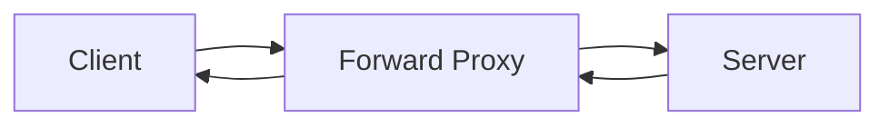
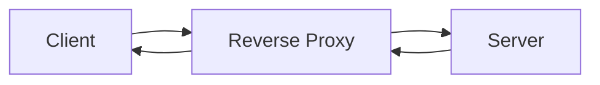

# Proxies

Proxies are a fundamental unit in system design with many uses. There are two types of proxies - Forward Proxies and Reverse Proxies. Many people refer to just "proxies" - this is almost always the forward type.

## Forward Proxies

- Sits inbetween clients and servers
- Is a server which acts on behalf of the client
- Client IP is typically masked
- A good example of this is a VPN
- Servers _are not aware_ of forward proxies

## Reverse Proxies

- Similar to forward proxies but acts on behalf of the server instead
- Clients _are not aware_ of reverse proxies - a DNS request for google.com might hit a reverse proxy, and clients don't realise this

These have multiple uses:
- Request filtering
- Logging/metrics
- Caching
- Load balancing

An example of a popular proxy is Nginx, which is a webserver often used for this purpose.