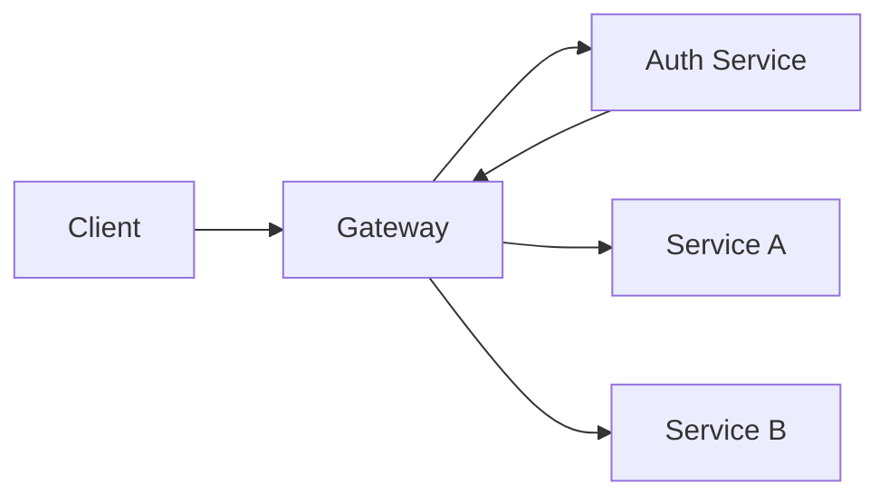
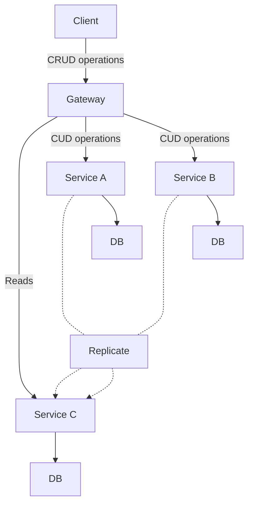

# Microservices

Microservices are a popular approach to building networked systems, in contrast to the now out-of-fashion monolithic model. A microservice architecture involves breaking down your business needs into clearly defined areas of concern, and then building small systems to deal with that specific usecase. This is called _functional decomposition_.

## Pros
- With well defined boundaries, microservices provide good levels of decoupling
- These decoupled units are easier to work on in teams without tripping over other people
- Teams can own these services, and engineers don't have to hold so much in their heads
- Both deployment and rolling back changes is far simpler and requires less coordination
- Each service can adopt a tech stack or data store which suits their individual needs or requirements

## Cons
- Each service having it's own data store means that you're more likely to adopt Eventual Consistency sooner rather than later. This isn't a bad thing _per se_, but something that you should be aware of
- Testing these deployments is incredibly difficult
- Can be very expensive

# The API Gateway
Clients should not be aware of dozens of microservices, so an API Gateway acts as a facade and provides routing, composition and translation:

## Routing
API Gateways typically provide a 1:1 mapping between external paths and internal paths. This means that internal changes don't affect clients because the gateway is transparent and unknown to the client.

## Composition
Gateways can query multiple services on your behalf and stitch this data back together for you into a useful representation.

This reduces the number of requests that a client has to make - on mobile this can be expensive/battery draining.

However, the availability of an API Gateway reduces as the number of internal requests it needs to make goes up, due to the chance of failure for each request.

## Translation
A gateway can also provide translation for different types of client - a web client may request more information or more granular information, whereas mobile clients may want just one request with less data.

They can also provide translation from one IPC mechanism to another - e.g. from a RESTful HTTP service to a gRPC one.

## Cross-cutting
Because gateways act as a middleman or proxy (NGINX, for example, is a common system for this), they can implement cross-cutting. Without cross-cutting, many services would have to implement the same logic multiple times - for instance, authentication and authorization.

Another common example is caching frequently accessed resources, improving performance and reducing the bandwidth requirements for other services.

## Drawbacks
An API Gateway is an eventual bottleneck and must also scale like any other service.

There is a limit to the composition model. Querying across multiple services can be very expensive, especially when this requires large in-memory joins.

The datastoremight be optimised for one specific thing but not another - for example, a simple relational database would not handle geospatial or graph queries well.

Equally, the datastore chosen might not scale to handle the number of reads, which is typically orders of magnitude more than the number of writes. To solve these problems, we can use CQRS.

# CQRS
Command Query Responsibility Segregation is a technique which decouples the read path from the write path of an API. These two paths can have different data models and different datastores backing them that fit the specific needs of reads and writes.

To keep these two synchronised, the write path posts updates to the read path - this inevitably results in some replication lag/eventual consistency issues. This is also more complex to manage.

